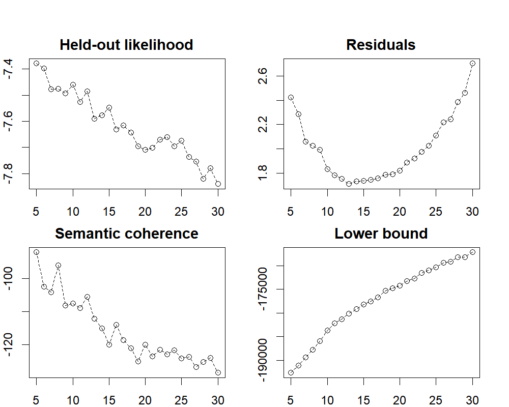

```{r setup, include=FALSE}
knitr::opts_chunk$set(
    cache = TRUE,
    message = FALSE, 
    warning = FALSE)
```

This webpage contains R codes used for Authors (2022). Data and scripts used for text preprocessing were posted through an online data repository at [https://osf.io/8cnyw/?view_only=74bfceb2ce37409ca3487606c3fd95e5](https://osf.io/8cnyw/?view_only=74bfceb2ce37409ca3487606c3fd95e5). 

## Import {.tabset}

### 1. Import a .xlsx file
```{r}
suppressPackageStartupMessages({
    library(tidyverse)
    library(readxl)
    library(tidytext)
    library(quanteda.textstats)
    library(textminingR)
    library(stm)
    library(psych)
    library(reshape2)
    library(cowplot)
    library(stminsights)
    library(ggraph)
    library(widyr)
    library(tidygraph)
    library(dplyr)
    library(ggplot2)
    library(rmarkdown)
    library(plotly)
})

raw_tbl <- read_excel("data/raw_data_xl.xlsx")

raw_tbl_period <- raw_tbl %>% mutate(period = dplyr::case_when(
    year >=1980 & year <= 1989 ~ "1980_to_1989",
    year >=1990 & year <= 1999 ~ "1990_to_1999",
    year >=2000 & year <= 2009 ~ "2000_to_2009",
    year >=2010 & year <= 2021 ~ "2010_to_2021")) %>% 
    dplyr::select(reference_type, author, year, period, everything()) 

paged_table(raw_tbl_period)
```


### 2. Preprocess 

#### Construct a document-feature matrix (dfm) from a tokens object. 
```{r}
united_tbl <- raw_tbl_period %>%
    mutate(year.c = year - 1980) %>%
    mutate(text_col_removed = 
               str_replace_all(abstract, 
                               c("Abstract: " = "",
                                 "Abstracts: " = "",
                                 "Aim: " = "",
                                 "Aims: " = "",
                                 "Background: " = "",
                                 "Conclusion: " = "",
                                 "Conclusions: " = "",
                                 "Design: " = "",
                                 "Discussion: " = "",
                                 "Effects of " = "",
                                 "Introduction: " = "",
                                 "Key words: " = "",
                                 "Keywords: " = "",
                                 "Implications for practitioners: " = "",
                                 "Implications for Rehabilitation: " = "",
                                 "Independent variables: " = "",
                                 "Measures: " = "",
                                 "Method: " = "",
                                 "Methods: " = "",
                                 "Methods and Procedures: " = "",
                                 "Purpose: " = "",
                                 "Objective: " = "",
                                 "Objectives: " = "",
                                 "Outcomes and Results: " = "",
                                 "Participant: " = "",
                                 "Participants: " = "",
                                 "Purpose: " = "",
                                 "Results: " = "",
                                 "Results and Conclusions: " = "",
                                 "Review of " = "",
                                 "Setting: " = "",
                                 "Study objective: " = "",
                                 "Subjects and Methods: " = "")
               )
    ) %>% 
    # Drop missing data
    drop_na(text_col_removed) %>%
    mutate(study_number = row_number()) %>% 
    ungroup()

load(file = "scripts/preprocess.all.RData")
toks_processed <- united_tbl %>% preprocess.all(text_field = "abstract", verbose = FALSE)


dfm <- dfm(toks_processed) 

dfm_td <- tidy(dfm)

dfm_idf <- dfm_td %>%
    bind_tf_idf(term, document, count) %>% 
    distinct(term, idf) %>% 
    arrange(idf, as.factor(term)) 

dfm_idf_5_pct <- dfm_idf %>%
    filter(idf < quantile(dfm_idf$idf, 0.05))

paged_table(dfm_idf_5_pct)
```


#### Remove stop words (common words across documents).
```{r}
source("scripts/stopwords_list.R", local = TRUE)

toks_processed_removed <-
    toks_processed %>% 
    tokens_remove(stopwords_list)

toks_processed_removed
```


#### Construct a second dfm after removing stop words.
```{r}
dfm_2 <- toks_processed_removed %>% dfm()
dfm_2
```


## Structural topic modeling {.tabset}

Given a vector of document covariates $X_d$, the topic proportion per document is defined as follows: $$\theta_{d, k}= \frac{\exp \left(\eta_{d, k}\right)}{\sum_{k=1}^K \exp \left(\eta_{d, k}\right)} \text {,} $$ where $\eta_d \sim \operatorname{Normal}\left(\mu_d=X_d \gamma, \Sigma\right);$ $\gamma$ is a coefficient matrix for the topic prevalence model, and $\Sigma$ is a covariance matrix (Roberts et al., 2016). The document-specific distribution over words is proportional to the combination of the baseline word frequency $(m)$ and the sparse topic-specific deviation from the baseline $(K_k)$ in the logarithmic space (Roberts et al., 2016): $$\beta_{d,k,y }=\frac{\exp \left(m_v+K_{k, v}\right)}{\sum_{k=1}^K \exp \left(m_v+K_{k, v}\right)} \text {,} $$ where $m$ and $K_k$ are vectors whose length is the number of distinct elements of vocabulary used in the current text mining, $v \in\{1, \ldots, 4,510\}$. 

### 1. Modeling
```{r fig.align="center", fig.width=50, fig.height=20}
out <- convert(dfm_2, to = "stm")

# library(stm)
# 
# set.seed(1234)
# K_search <- searchK(out$documents,
#                     out$vocab,
#                     data = out$meta,
#                     max.em.its = 75,
#                     init.type = "Spectral",
#                     K = c(5:30),
#                     prevalence = ~
#                         I((year >= 1980)*(year - 1980)) +
#                         I((year >= 1990)*(year - 1990)) +
#                         I((year >= 2000)*(year - 2000)) +
#                         I((year >= 2010)*(year - 2010)),
#                     verbose = TRUE)

# # from stm https://github.com/bstewart/stm
# plot.searchK <-function(x, ...){
#   oldpar <- par(no.readonly=TRUE)
#   g <- x$results
#   par(mfrow=c(2,2),mar=c(2,2,2,2),oma=c(0,0,2,0), cex=3.5)
# 
#   plot(g$K,g$heldout,type="p", main="Held-out likelihood", xlab="", ylab="")
#   lines(g$K,g$heldout,lty=2,col=2)
# 
#   plot(g$K,g$residual,type="p", main="Residuals", xlab="", ylab="")
#   lines(g$K,g$residual,lty=2,col=2 )
# 
#   if(!is.null(g$semcoh)){
#     plot(g$K,g$semcoh,type="p", main="Semantic coherence", xlab="", ylab="")
#     lines(g$K,g$semcoh,lty=2,col=2 )
#   }
# 
#   plot(g$K,g$lbound,type="p", main="Lower bound", xlab="", ylab="")
#   lines(g$K,g$lbound,lty=2,col=2 )
# 
#   par(oldpar)
# }

# plot(K_search_plot)


```


### 2. Estimated effects
```{r}
#### Convert quanteda objects to stm package format.

set.seed(1234)
stm_15 <- stm(out$documents,
              out$vocab,
              data = out$meta,
              prevalence = ~ 
                  I((year >= 1980)*(year - 1980)) +
                  I((year >= 1990)*(year - 1990)) +
                  I((year >= 2000)*(year - 2000)) +
                  I((year >= 2010)*(year - 2010)),
              max.em.its = 75,
              init.type = 'Spectral',
              K = 15,
              verbose = FALSE)

# Model estimated effects.
set.seed(1234)
effect_stm_15 <- estimateEffect(1:15 ~ 
                                    I((year >= 1980)*(year - 1980)) +
                                    I((year >= 1990)*(year - 1990)) +
                                    I((year >= 2000)*(year - 2000)) +
                                    I((year >= 2010)*(year - 2010)),
                                stm_15,
                                metadata = out$meta,
                                documents = out$documents,
                                uncertainty = "Global")

set.seed(1234)
effect_stm_15_td <- tidy(effect_stm_15)

labeled_topic_list <- c(
    "CAI", 
    "Calculators", 
    "Visual-based technology",
    "Learning disabilities",
    "Math achievement", 
    "Instructional sequence",
    "Auditory support",
    "Self-monitoring tools",
    "Software",
    "Robotics", 
    "Support for visual materials",
    "Testing",
    "WPS instruction", 
    "Apps", 
    "Fractions instruction"
)

names(labeled_topic_list) <- c(1,2,3,4,5,6,7,8,9,10,11,12,13,14, 15)

effect_stm_15_td <- effect_stm_15_td %>% 
    mutate(topic_label = as.factor(labeled_topic_list[effect_stm_15_td$topic])) %>%
    dplyr::select(topic, topic_label, term, estimate, std.error, statistic, p.value) %>%
    mutate(estimate = weights::rd(estimate, add=FALSE, digits = 3)) %>%
    mutate(std.error = weights::rd(std.error, add=FALSE, digits = 3)) %>%
    mutate(statistic = weights::rd(statistic, add=FALSE, digits = 3)) %>%
    mutate(p.value = weights::rd(p.value, add=FALSE, digits = 3)) 

DT::datatable(effect_stm_15_td) 
```


### 3. Results
```{r}
#### Tidy the word-topic combinations (per-topic-per-term probabilities).

united_tbl <- read_excel("data/united_tbl.xlsx")

stm_15$vocab <- dplyr::case_when(
    stm_15$vocab == "aac" ~ "AAC",
    stm_15$vocab == "adhd" ~ "ADHD",
    stm_15$vocab == "asd" ~ "ASD",
    stm_15$vocab == "assistive_technology" ~ "assistive technology",
    stm_15$vocab == "baip" ~ "BAIP",
    stm_15$vocab == "basic_skill" ~ "basic skill",
    stm_15$vocab == "blended_learning" ~ "blended learning",
    stm_15$vocab == "bmt" ~ "BMT",
    stm_15$vocab == "cai" ~ "CAI",
    stm_15$vocab == "cbm" ~ "CBM",
    stm_15$vocab == "ccss" ~ "CCSS",
    stm_15$vocab == "concrete_manipulatives" ~ "concrete manipulatives",
    stm_15$vocab == "cra" ~ "CRA",
    stm_15$vocab == "digital_text" ~ "digital text", 
    stm_15$vocab == "drill_practice" ~ "drill and practice",
    stm_15$vocab == "eai" ~ "EAI",
    stm_15$vocab == "ebd" ~ "EBD",
    stm_15$vocab == "ebp" ~ "EBP",
    stm_15$vocab == "eworkbook" ~ "eWorkbook",
    stm_15$vocab == "explicit_instruction" ~ "explicit instruction",
    stm_15$vocab == "functional_relation" ~ "functional relation",
    stm_15$vocab == "fxs" ~ "FXS",
    stm_15$vocab == "graphing_calculator" ~ "graphing calculator",
    stm_15$vocab == "high_school" ~ "high school",
    stm_15$vocab == "ict" ~ "ICT",
    stm_15$vocab == "instructional_sequence" ~ "instructional sequence",
    stm_15$vocab == "intellectual_disability" ~ "intellectual disability",
    stm_15$vocab == "ipad" ~ "iPad",
    stm_15$vocab == "ipod" ~ "iPod",
    stm_15$vocab == "kindle" ~ "Kindle",
    stm_15$vocab == "learning_disability" ~ "learning disability",
    stm_15$vocab == "learning_disabled" ~ "learning disabled",
    stm_15$vocab == "mathematics_disability" ~ "mathematics disability",
    stm_15$vocab == "mathematics_skill" ~ "mathematics skill",
    stm_15$vocab == "middle_school" ~ "middle school",
    stm_15$vocab == "mld" ~ "MLD",
    stm_15$vocab == "more" ~ "MORE",
    stm_15$vocab == "multiple_baseline" ~ "multiple baseline",
    stm_15$vocab == "multiple_probe" ~ "multiple probe",
    stm_15$vocab == "multiplication_fact" ~ "multiplication fact",
    stm_15$vocab == "oer" ~ "OER",
    stm_15$vocab == "paper_pencil" ~ "paper and pencil",
    stm_15$vocab == "problem_solving" ~ "problem solving",
    stm_15$vocab == "rti" ~ "RtI",
    stm_15$vocab == "sbi" ~ "SBI",
    stm_15$vocab == "secondary_student" ~ "secondary student",
    stm_15$vocab == "self_monitoring" ~ "self-monitoring",
    stm_15$vocab == "single_case" ~ "single case",
    stm_15$vocab == "single_subject" ~ "single subject",
    stm_15$vocab == "speech_generating" ~ "speech generating", 
    stm_15$vocab == "stem" ~ "STEM",
    stm_15$vocab == "udl" ~ "UDL",
    stm_15$vocab == "video_modeling" ~ "video modeling",
    stm_15$vocab == "video_prompting" ~ "video prompting",
    stm_15$vocab == "virtual_abstract" ~ "virtual-abstract",
    stm_15$vocab == "virtual_manipulatives" ~ "virtual manipulatives",
    stm_15$vocab == "visual_impairment" ~ "visual impairment",
    stm_15$vocab == "visually_impaired" ~ "visually impaired",
    stm_15$vocab == "vra" ~ "VRA",
    stm_15$vocab == "word_problem" ~ "word problem",
    
    TRUE ~ as.character(stm_15$vocab)
)

set.seed(1234)
beta_td <- tidy(stm_15, document_names = rownames(dfm_2), log = FALSE)

#### Replace integers with character values in the topic.

beta_td <- beta_td %>% 
    mutate(topic_label = as.factor(labeled_topic_list[beta_td$topic])) %>% 
    dplyr::select(topic, topic_label, term, beta)

beta_td_selected <- beta_td %>%
    group_by(topic_label) %>%
    top_n(10, beta) %>%
    arrange(topic_label, desc(beta)) %>%
    mutate(beta = weights::rd(beta, add=FALSE, digits = 3))
    
beta_td_selected$beta <- paste0("(", beta_td_selected$beta, ")")

beta_td_selected$term <- paste(beta_td_selected$term, beta_td_selected$beta)


beta_td_selected_combined <- beta_td_selected %>%
    group_by(topic_label) %>%
    summarise(Terms = str_c(term, collapse =", "))


#### Examine the document-topic combinations (per-document-per topic probabilities).

set.seed(1234)
theta_td_int <- tidy(stm_15, matrix = "theta",
                 document_names = rownames(dfm_2@docvars$study_number)) 

theta_td_int$study_number <- theta_td_int$document
theta_td_int$theta <- theta_td_int$gamma

# Replace integers with character values in the topic.

theta_td <- theta_td_int %>% left_join(united_tbl, by = "study_number") %>%
    mutate(topic_label = as.factor(labeled_topic_list[theta_td_int$topic]))

theta_td <- theta_td %>% dplyr::select(document, study_number, topic, topic_label, 
                                       everything())

theta_td_mean <- theta_td %>%
    group_by(topic_label) %>%
    summarise(theta = mean(theta)) %>%
    mutate(topic = reorder(topic_label, theta))

theta_td_mean <- theta_td_mean %>% mutate(theta = round(theta, 3))

# Create correlation matrix (Correlation between topic proportion and year).

cor_topic <- cbind(stm_15$theta,
        theta_td %>% dplyr::select(year)) %>% corr.test()

cor_topic <- cor_topic$r

colnames(cor_topic) <- c(labeled_topic_list, 'year')
rownames(cor_topic) <- c(labeled_topic_list, 'year')

cor_topic <- cor_topic %>% melt()

p_topic <- cbind(stm_15$theta,
        theta_td %>% dplyr::select(year)) %>% corr.test()

p_topic <- p_topic$p

p_topic <- p_topic %>% melt()

p_topic$p.sig <-
  case_when(
    is.na(p_topic$value) ~ "",
    p_topic$value < 0.001 ~ "***",
    p_topic$value < 0.01 ~ "**",
    p_topic$value < 0.05 ~ "*",
    TRUE ~ ""
  )

cor_topic <- bind_cols(cor_topic, p_topic) 
names(cor_topic) <- c("labeled_topic", "labeled_topic_group", "r", 
                      "labeled_topic_f", "labeled_topic_group_f", "p", "p.sig")
cor_topic <- cor_topic %>% dplyr::select(labeled_topic, labeled_topic_group, r, p, p.sig)

cor_topic <- cor_topic %>% filter(labeled_topic %in% 'year')
cor_topic <- cor_topic %>% filter(!labeled_topic_group %in% 'year')

cor_topic <- cor_topic %>%
  mutate(p.ast  = if_else(
    r < 0,
    str_replace_all(p.sig, '\\*', '-'),
    str_replace_all(p.sig, '\\*', '+')
  ))

cor_topic_clean <- cor_topic %>%
    mutate(r = weights::rd(r, add=FALSE, digits = 2)) %>%
    mutate(p = weights::rd(p, add=FALSE, digits = 3))

cor_topic_clean$r <- paste0(cor_topic_clean$r, cor_topic_clean$p.sig)

#### Replace character vectors

dfm_2@Dimnames$features <- dplyr::case_when(
    
    dfm_2@Dimnames$features == "aac" ~ "AAC",
    dfm_2@Dimnames$features == "adhd" ~ "ADHD",
    dfm_2@Dimnames$features == "asd" ~ "ASD",
    dfm_2@Dimnames$features == "assistive_technology" ~ "assistive technology",
    dfm_2@Dimnames$features == "baip" ~ "BAIP",
    dfm_2@Dimnames$features == "basic_skill" ~ "basic skill",
    dfm_2@Dimnames$features == "blended_learning" ~ "blended learning",
    dfm_2@Dimnames$features == "bmt" ~ "BMT",
    dfm_2@Dimnames$features == "cai" ~ "CAI",
    dfm_2@Dimnames$features == "cbm" ~ "CBM",
    dfm_2@Dimnames$features == "ccss" ~ "CCSS",
    dfm_2@Dimnames$features == "concrete_manipulatives" ~ "concrete manipulatives",
    dfm_2@Dimnames$features == "cra" ~ "CRA",
    dfm_2@Dimnames$features == "digital_text" ~ "digital text", 
    dfm_2@Dimnames$features == "drill_practice" ~ "drill and practice",
    dfm_2@Dimnames$features == "eai" ~ "EAI",
    dfm_2@Dimnames$features == "ebd" ~ "EBD",
    dfm_2@Dimnames$features == "ebp" ~ "EBP",
    dfm_2@Dimnames$features == "eworkbook" ~ "eWorkbook",
    dfm_2@Dimnames$features == "explicit_instruction" ~ "explicit instruction",
    dfm_2@Dimnames$features == "functional_relation" ~ "functional relation",
    dfm_2@Dimnames$features == "fxs" ~ "FXS",
    dfm_2@Dimnames$features == "graphing_calculator" ~ "graphing calculator",
    dfm_2@Dimnames$features == "high_school" ~ "high school",
    dfm_2@Dimnames$features == "ict" ~ "ICT",
    dfm_2@Dimnames$features == "instructional_sequence" ~ "instructional sequence",
    dfm_2@Dimnames$features == "intellectual_disability" ~ "intellectual disability",
    dfm_2@Dimnames$features == "ipad" ~ "iPad",
    dfm_2@Dimnames$features == "ipod" ~ "iPod",
    dfm_2@Dimnames$features == "kindle" ~ "Kindle",
    dfm_2@Dimnames$features == "learning_disability" ~ "learning disability",
    dfm_2@Dimnames$features == "learning_disabled" ~ "learning disabled",
    dfm_2@Dimnames$features == "mathematics_disability" ~ "mathematics disability",
    dfm_2@Dimnames$features == "mathematics_skill" ~ "mathematics skill",
    dfm_2@Dimnames$features == "middle_school" ~ "middle school",
    dfm_2@Dimnames$features == "mld" ~ "MLD",
    dfm_2@Dimnames$features == "more" ~ "MORE",
    dfm_2@Dimnames$features == "multiple_baseline" ~ "multiple baseline",
    dfm_2@Dimnames$features == "multiple_probe" ~ "multiple probe",
    dfm_2@Dimnames$features == "multiplication_fact" ~ "multiplication fact",
    dfm_2@Dimnames$features == "oer" ~ "OER",
    dfm_2@Dimnames$features == "paper_pencil" ~ "paper and pencil",
    dfm_2@Dimnames$features == "problem_solving" ~ "problem solving",
    dfm_2@Dimnames$features == "rti" ~ "RtI",
    dfm_2@Dimnames$features == "sbi" ~ "SBI",
    dfm_2@Dimnames$features == "secondary_student" ~ "secondary student",
    dfm_2@Dimnames$features == "self_monitoring" ~ "self-monitoring",
    dfm_2@Dimnames$features == "single_case" ~ "single case",
    dfm_2@Dimnames$features == "single_subject" ~ "single subject",
    dfm_2@Dimnames$features == "speech_generating" ~ "speech generating", 
    dfm_2@Dimnames$features == "stem" ~ "STEM",
    dfm_2@Dimnames$features == "udl" ~ "UDL",
    dfm_2@Dimnames$features == "video_modeling" ~ "video modeling",
    dfm_2@Dimnames$features == "video_prompting" ~ "video prompting",
    dfm_2@Dimnames$features == "virtual_abstract" ~ "virtual-abstract",
    dfm_2@Dimnames$features == "virtual_manipulatives" ~ "virtual manipulatives",
    dfm_2@Dimnames$features == "visual_impairment" ~ "visual impairment",
    dfm_2@Dimnames$features == "visually_impaired" ~ "visually impaired",
    dfm_2@Dimnames$features == "vra" ~ "VRA",
    dfm_2@Dimnames$features == "word_problem" ~ "word problem",
    
    TRUE ~ as.character(dfm_2@Dimnames$features)
)

dfm_2_td <- tidy(dfm_2)

# Merge data tables.

theta_td$document <- as.character(theta_td$document)

dfm_gamma <- dfm_2_td %>%
    left_join(y = theta_td, by = c("document" = "document"))

theta_td_mean_cor <- cor_topic_clean %>%
    left_join(y = theta_td_mean, by = c("labeled_topic_group" = "topic_label")) %>%
    arrange(desc(r)) %>%
    ungroup()

theta_td_mean_cor <- theta_td_mean_cor %>%
    select(topic, theta, r, p) 

theta_td_mean_cor_beta <- theta_td_mean_cor %>%
    left_join(y = beta_td_selected_combined, by = c("topic" = "topic_label")) %>%
    ungroup()

theta_td_mean_cor_beta_selected <- theta_td_mean_cor_beta %>%
    dplyr::select(Terms, topic, theta, r, p) %>%
    mutate(theta = weights::rd(theta, add=FALSE, digits = 3)) %>%
    arrange(desc(theta)) %>%
    ungroup()

theta_td_mean_cor_beta_selected$theta <- paste0("(", theta_td_mean_cor_beta_selected$theta, ")")

theta_td_mean_cor_beta_selected$Topics <- paste(theta_td_mean_cor_beta_selected$topic, theta_td_mean_cor_beta_selected$theta)

theta_td_mean_cor_beta_selected_update <- theta_td_mean_cor_beta_selected %>%
    select(Terms, Topics, r, p)

DT::datatable(theta_td_mean_cor_beta_selected_update)
```


### 4. Topic distribution 
```{r fig.align="center", fig.width = 8, fig.height= 8}
theta_td$period <- dplyr::case_when(
    theta_td$period == "1980_to_1989" ~ "1980 to 1989",
    theta_td$period == "1990_to_1999" ~ "1990 to 1999",
    theta_td$period == "2000_to_2009" ~ "2000 to 2009",
    theta_td$period == "2010_to_2021" ~ "2010 to 2021",
    
    TRUE ~ as.character(theta_td$period)
)

topic_by_prevalence_publication <- theta_td %>%
    ggplot(aes(study_number, theta, color = as.factor(period))) +
    geom_line(show.legend = TRUE, linewidth = 0.3) +
    lemon::facet_rep_wrap(~ topic_label, repeat.tick.labels = FALSE, ncol = 3) +
    labs(x = "Publications",
        y = expression("Topic proportion" ~ (theta)),
        color = "Period",
        size = 11) +
    scale_y_continuous(labels = numform::ff_num(zero = 0, digits = 2)) +
    theme_minimal(base_size = 11) +
    theme(panel.grid.major = element_blank(),
          panel.grid.minor = element_blank(),
          axis.line = element_line(color = "#3B3B3B", linewidth = 0.3),
          axis.ticks = element_line(color = "#3B3B3B", linewidth = 0.3),
          strip.text.x = element_text(size = 11, color = "#3B3B3B"), 
          axis.text.x = element_text(size = 11, color = "#3B3B3B"),
          axis.text.y = element_text(size = 11, color = "#3B3B3B"),
          axis.title = element_text(size = 11, color = "#3B3B3B"),
          axis.title.x = element_text(margin = margin(t = 10)),
          axis.title.y = element_text(margin = margin(r = 10)),
          legend.title = element_text(size = 11, color = "#3B3B3B"),
          legend.text = element_text(size = 11, color = "#3B3B3B"),
          legend.title.align = 0.5,
          legend.position = "bottom")  

topic_by_prevalence_publication 
```


### 5. Topic proportion by year
```{r fig.align="center", fig.width = 8, fig.height= 8}
effects_year <- get_effects(estimates = effect_stm_15,
                            variable = 'year',
                            type = 'pointestimate')

effects_year <- effects_year %>%
    mutate(topic_label = labeled_topic_list[as.character(effects_year$topic)]) %>%
    dplyr::select(value, topic, topic_label, proportion, lower, upper) 

effects_year <- effects_year %>%
    mutate(year = as.numeric(effects_year$value) + 1979) 

year_plot <- effects_year %>%
    ggplot(aes(x = year, y = proportion)) +
    facet_wrap(~ topic_label, ncol = 3, scales = "free") +
    scale_y_continuous(labels = numform::ff_num(zero = 0, digits = 3)) +
    geom_line(color = "#3B3B3B", linewidth = 0.3) +
    xlab('Publication year') + 
    ylab(expression("Topic proportion" ~ (theta))) +
    theme_minimal(base_size = 11) +
    theme(
          panel.grid.major = element_blank(),
          panel.grid.minor = element_blank(),
          axis.line = element_line(color = "#3B3B3B", linewidth = 0.3),
          axis.ticks = element_line(color = "#3B3B3B", linewidth = 0.3),
          strip.text.x = element_text(size = 11, color = "#3B3B3B"), 
          axis.text.x = element_text(size = 11, color = "#3B3B3B"),
          axis.text.y = element_text(size = 11, color = "#3B3B3B"),
          axis.title = element_text(size = 11, color = "#3B3B3B"),
          axis.title.x = element_text(margin = margin(t = 10)),
          axis.title.y = element_text(margin = margin(r = 10)))

year_plot 
```


## Word network analysis {.tabset}

### 1. 1980 to 1989
```{r fig.align="center", fig.width = 6, fig.height= 5.5}

word_co_by_1989 <- dfm_gamma %>%
    filter(year >=1980 & year <= 1989) %>%
    pairwise_count(term, study_number, sort = TRUE) 

# summary(word_co_by_1989)

set.seed(1234)
graph_1989_td <- word_co_by_1989 %>%
    filter(n >= 4) %>%
    as_tbl_graph(directed = TRUE) %>% 
    mutate(centrality = centrality_degree(mode = "out") / (39-1)) 

set.seed(1234)
layout_1989 <- create_layout(graph_1989_td, 
                        layout = "stress")

set.seed(1234)
network_1989 <- layout_1989 %>% 
    ggraph() + 
    geom_edge_link(aes(edge_alpha = n), edge_colour = "#bdbdbd", edge_width = 1) + 
    geom_node_point(aes(size = centrality, colour = centrality)) +
    geom_node_text(aes(label = name), size = 4, repel = TRUE) +
    scale_color_continuous(guide = 'legend', high = "#3182bd", low = "#deebf7") +
    theme_void(base_size = 13) +
    theme(legend.title=element_blank(), 
          legend.text=element_text(size = 11),
          legend.position = "right")

network_1989 
```


### 2. 1990 to 1999
```{r fig.align="center", fig.width = 6.5, fig.height= 5.5}
word_co_by_1999 <- dfm_gamma %>%
    filter(year >=1990 & year <= 1999) %>%
    pairwise_count(term, study_number, sort = TRUE) 

# summary(word_co_by_1999)

set.seed(1234)
graph_1999_td <- word_co_by_1999 %>%
    filter(n >= 4) %>%
    as_tbl_graph(directed = TRUE) %>% 
    mutate(centrality = centrality_degree(mode = "out") / (43-1)) 

set.seed(1234)
layout_1999 <- create_layout(graph_1999_td, 
                        layout = "stress")

set.seed(1234)
network_1999 <- layout_1999 %>% 
    ggraph() + 
    geom_edge_link(aes(edge_alpha = n), edge_colour = "#bdbdbd", edge_width = 1) + 
    geom_node_point(aes(size = centrality, colour = centrality)) +
    geom_node_text(aes(label = name), size = 4, repel = TRUE) +
    scale_color_continuous(guide = 'legend', high = "#3182bd", low = "#deebf7") +
    theme_void(base_size = 13) +
    theme(legend.title=element_blank(), 
          legend.text=element_text(size = 11),
          legend.position = "right")

network_1999 
```


### 3. 2000 to 2009
```{r fig.align="center", fig.width = 7.5, fig.height= 8.5}
word_co_by_2009 <- dfm_gamma %>%
    filter(year >=2000 & year <= 2009) %>%
    pairwise_count(term, study_number, sort = TRUE) 

# summary(word_co_by_2009)

set.seed(1234)
graph_2009_td <- word_co_by_2009 %>%
    filter(n >= 4) %>%
    as_tbl_graph(directed = TRUE) %>% 
    mutate(centrality = centrality_degree(mode = "out") / (52-1)) # check

set.seed(1234)
layout_2009 <- create_layout(graph_2009_td, 
                        layout = "stress")

set.seed(1234)
network_2009 <- layout_2009 %>% 
    ggraph() + 
    geom_edge_link(aes(edge_alpha = n), edge_colour = "#bdbdbd", edge_width = 1) +  
    geom_node_point(aes(size = centrality, colour = centrality)) +
    geom_node_text(aes(label = name), size = 4, repel = TRUE) +
    scale_color_continuous(guide = 'legend', high = "#3182bd", low = "#deebf7") +
    theme_void(base_size = 13) +
    theme(legend.title=element_blank(), 
          legend.text=element_text(size = 11),
          legend.position = "right")
network_2009 
```


### 4. 2010 to 2021
```{r fig.align="center", fig.width = 7.2, fig.height= 7}
word_co_by_2021 <- dfm_gamma %>%
    filter(year >=2010 & year <= 2021) %>%
    pairwise_count(term, study_number, sort = TRUE) 

# summary(word_co_by_2021)

set.seed(1234)
graph_2021_td <- word_co_by_2021 %>%
    filter(n >= 14) %>%
    as_tbl_graph(directed = TRUE) %>% 
    mutate(centrality = centrality_degree(mode = "out") / (51-1)) # check

set.seed(1234)
layout_2021 <- create_layout(graph_2021_td, 
                        layout = "stress")

set.seed(1234)
network_2021 <- layout_2021 %>% 
    ggraph() + 
    geom_edge_link(aes(edge_alpha = n), edge_colour = "#bdbdbd", edge_width = 1) + 
    geom_node_point(aes(size = centrality, colour = centrality)) +
    geom_node_text(aes(label = name), size = 4, repel = TRUE) +
    scale_color_continuous(guide = 'legend', high = "#3182bd", low = "#deebf7") +
    theme_void(base_size = 13) +
    theme(legend.title=element_blank(), 
          legend.text=element_text(size = 11),
          legend.position = "right")

network_2021
```


## Total number of publications {.tabset}

```{r fig.align="center", fig.width = 7.2, fig.height= 4}

#### Number of publications over time

year_doc_counts_all <- united_tbl %>%
  group_by(year) %>%
  summarize(publication_number = n()) %>%
  ungroup()

plot_year_doc_counts <- year_doc_counts_all %>%
  ggplot(aes(year, publication_number)) +
  geom_col(fill = "#979797") + 
    theme_classic() +
    theme(
        axis.line = element_line(color = "#3B3B3B", linewidth = 0.2),
        axis.title = element_text(size = 11, color = "#3B3B3B"),
        axis.title.x = element_text(margin = margin(t = 10), color = "#3B3B3B"),
        axis.title.y = element_text(margin = margin(r = 10), color = "#3B3B3B")) +
    labs(x = "Year", y = "Number of publications")

plot_year_doc_counts 
```


